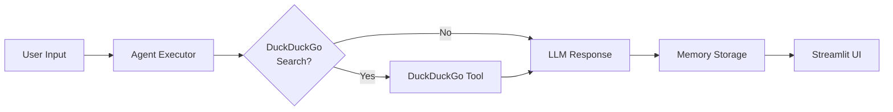

# Multi-Agent Company Intelligence System (LangGraph)

***

## Source Code

**Task 1: Multi-Agent Company Intelligence System**

This repository contains the complete source code for a **Multi-Agent AI System** implemented using **LangGraph / LangChain**.  
The system is designed with modular components, where each agent has a well-defined responsibility and is orchestrated through a controller to perform a multi-step task.

***

## 📋 **README with Architecture Diagram / Flow Description**

### **System Architecture**

```
┌─────────────────┐     ┌──────────────────┐     ┌──────────────────┐
│   User Input    │────▶│  Orchestrator    │────▶│ Final Output     │
│ (Company Name)  │     │  (Controller)    │     │                  │
└─────────────────┘     └──────────────────┘     └──────────────────┘
                                │
                                ▼
                       ┌──────────────────┐     ┌──────────────────┐
                       │ Data Collector   │────▶│    Analyst       │
                       │ Agent            │     │    Agent         │
                       └──────────────────┘     └──────────────────┘
                                │
                                ▼
                       ┌──────────────────┐
                       │ Shared Context   │
                       │  / Memory        │
                       │ (LangGraph State)│
                       └──────────────────┘
```

### **Agent Roles**

| **Agent** | **Responsibility** | **Inputs** | **Outputs** |
|-----------|-------------------|------------|-------------|
| **Data Collector** | Collects company data (news, stock performance) | Company name | Structured factual data |
| **Analyst** | Analyzes data & generates insights | Collected data | Market summary, insights, risks |
| **Orchestrator** | Controls execution flow & combines outputs | User input | Final intelligence report |

***

## 🚀 **Instructions to Run**

```bash
# 1. Clone repository
git clone https://github.com/SreelekhaP/SreelekhaP-Soulpage-genai-assignment-sreelekha.git
cd SreelekhaP-Soulpage-genai-assignment-sreelekha

# 2. Install dependencies
pip install -r requirements.txt

# 3. Run Streamlit app
streamlit run app.py
```

**🌐 Access**: `http://localhost:8501`

***

## 🛠️ **Technologies Used**

```python
• Python          # Core programming
• LangChain       # Agent framework
• LangGraph       # Multi-agent orchestration
• Streamlit       # Interactive UI
• LLM             # Intelligence layer
```

***

# **Task 2: Conversational Knowledge Bot** 🤖

## **Overview**

**Streamlit-powered AI assistant** that:
- ✅ Remembers previous conversations (**10 exchanges**)
- ✅ Searches web using **DuckDuckGo** (free, no API key)
- ✅ Provides **contextually relevant** responses

## **Key Features**

| **Feature** | **Implementation** |
|-------------|-------------------|
| **Memory** | `ConversationBufferWindowMemory(k=10)` |
| **Web Search** | `DuckDuckGoSearchRun()` tool |
| **Conversational AI** | `GPT-4o-mini` via LangChain |
| **UI** | **Streamlit** chat interface |

## **Architecture Flow**



***

## **🚀 Setup Instructions**

```bash
# 1. Clone repository
git clone https://github.com/yourusername/Soulpage-genai-assignment-yourname.git
cd Soulpage-genai-assignment-yourname

# 2. Install dependencies
pip install -r requirements.txt

# 3. Add OpenAI API key (.env file)
echo "OPENAI_API_KEY=sk-your-key-here" > .env

# 4. Run app
streamlit run app.py
```

***

## **💬 Sample Conversation**

```
User: Who is the CEO of OpenAI?
└── Bot: The CEO of OpenAI is **Sam Altman**.

User: Where did he study?
└── Bot: Sam Altman studied **computer science** at **Stanford University**.

User: Latest news on OpenAI?
└── Bot: [🔍 Searches DuckDuckGo] Latest updates include...
```

***

## **🧠 Memory Design**

```python
ConversationBufferWindowMemory(
    k=10,                    # Last 10 exchanges
    return_messages=True,    # Message format
    memory_key="chat_history" # Agent integration
)
```

***

## **🔧 Tools Used**

| **Tool** | **Purpose** | **API Key** |
|----------|-------------|-------------|
| `DuckDuckGoSearchRun()` | **Free web search** | ❌ None needed |
| `GPT-4o-mini` | **Conversational intelligence** | ✅ OpenAI key |

***

## **📝 Notes**

- **Automatic context referencing** from conversation history
- **Intelligent tool usage** - searches only when needed
- **Customizable memory** - adjust `k` parameter
- **Production-ready** Streamlit deployment

***
